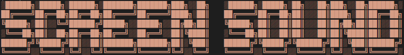

<h4 align="center"> Projeto do curso C#: Orientação a Objetos @ Alura </h4>

 
## Descrição
Projeto de músicas/bandas para o curso de orientação a objetos em C#.  
Classes com atributos e relacionamento entre elas, manipulação de variáveis, métodos e propriedades, lambda e construtores.  
>Por final foi adicionada uma ramificação com a classe Podcast e Episodio pra ter como exemplo a funcionalidade e capacidade de expansão do código.  
## Funcionalidades
:heavy_check_mark: Criar música com nome, artista, gênero, duração e disponibilidade  

:heavy_check_mark: Listar e relacionar as músicas à listas álbuns com nome e duração total  

:heavy_check_mark: Relacionar álbuns listados à bandas com nome  

:heavy_check_mark: Criar episódios com ordem, título e duração  

:heavy_check_mark: Adicionar lista de episódios à podcasts com nome e host  

:heavy_check_mark: Usar métodos para exibir em detalhes informações sobre os itens acima  
## Desenvolvedor
|  [ Gabriel Freitas](https://github.com/freitasgabb7)
:---: |
